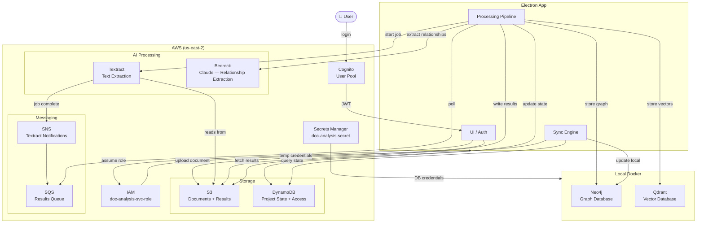

# Document Analysis Application

Local application for extracting relationships between entities (people, money, property, objects) across batches of documents. Uses an Electron front-end, AWS for document processing and cloud state, and local Docker containers for graph and vector storage.

---

## Architecture



### How it works

1. **Auth** — User logs in via Cognito. The app assumes `doc-analysis-svc-role` for all AWS resource access.
2. **Upload** — Documents are uploaded to S3. A Textract async job is started with an SNS notification channel.
3. **Processing** — Textract extracts text and structure. The app polls SQS for job completion, then calls Bedrock (Claude) to extract entity relationships.
4. **Storage** — Results are written to S3 (JSON), DynamoDB (project state), Neo4j (graph), and Qdrant (vectors).
5. **Sync** — On any device, the app compares DynamoDB project state against local Neo4j and fetches missing results from S3 to sync.

---

## Prerequisites

- [Docker Desktop](https://www.docker.com/products/docker-desktop/)
- [AWS CLI](https://docs.aws.amazon.com/cli/latest/userguide/install-cliv2.html) configured with a valid IAM user (`aws configure`)

---

## Infrastructure (Terraform)

AWS resources for this project are managed via Terraform in the [Terraform/](Terraform/) folder. Deployment is triggered manually via a GitHub Actions workflow.

### GitHub Actions workflow

1. Go to your repository on GitHub
2. Navigate to **Actions** → **AWS Setup**
3. Click **Run workflow** and select the branch

The workflow uses OIDC to authenticate with AWS — no AWS credentials need to be stored in GitHub. The required repository secrets and variables are:

| Type | Name | Description |
|---|---|---|
| Secret | `AWS_ACCOUNT_ID` | Your 12-digit AWS account ID |
| Secret | `AWS_DEPLOY_SVC_ACCT_ARN` | ARN of the GitHub Actions IAM role |
| Secret | `AWS_USER_ARN` | ARN of the IAM user allowed to assume the service role |
| Variable | `AWS_RESOURCE_REGION` | AWS region (e.g. `us-east-2`) |
| Variable | `PROJECT` | Human-readable project name |
| Variable | `TF_PROJECT_NAME` | Slug used for resource naming (e.g. `doc-analysis-app`) |
| Variable | `OWNER` | Owner name tagged on resources |
| Variable | `SECRETS_MANAGER_PATH` | Secrets Manager secret name (e.g. `doc-analysis-secret`) |

### Running Terraform locally

If you do not have access to the repository secrets, install [Terraform](https://developer.hashicorp.com/terraform/install) locally and pass all variables explicitly:

```bash
cd Terraform
terraform init
terraform apply \
  -var="account_id=YOUR_ACCOUNT_ID" \
  -var="region=us-east-2" \
  -var="project=Document Analysis Application" \
  -var="tf_project_name=doc-analysis-app" \
  -var="owner=YOUR_NAME" \
  -var="user_arn=arn:aws:iam::YOUR_ACCOUNT_ID:user/YOUR_USERNAME" \
  -var="github_org=YOUR_GITHUB_ORG" \
  -var="github_repo=YOUR_REPO_NAME" \
  -var="secrets_manager_path=doc-analysis-secret"
```

After a successful apply, note the `svc_role_arn` output — you will need it when running `deploy.sh`.

---

## Local Services (Docker Compose)

Neo4j and Qdrant run locally via Docker Compose. Credentials are stored in a single AWS Secrets Manager secret and fetched at deploy time by [deploy.sh](deploy.sh).

### First-time setup

1. **Create the secret in AWS Secrets Manager** with the following key/value pairs:

   ```bash
   aws secretsmanager create-secret \
     --name "doc-analysis-secret" \
     --secret-string '{"SVC_USER":"your-username","SVC_PWD":"your-password","QDRANT_KEY":"your-qdrant-api-key"}'
   ```

   If the secret already exists, update it:

   ```bash
   aws secretsmanager put-secret-value \
     --secret-id "doc-analysis-secret" \
     --secret-string '{"SVC_USER":"your-username","SVC_PWD":"your-password","QDRANT_KEY":"your-qdrant-api-key"}'
   ```

2. **Ensure your IAM user has permission** to assume the `doc-analysis-svc-role` created by Terraform.

### Starting the services

```bash
chmod +x deploy.sh   # first time only
./deploy.sh
```

When prompted, enter the IAM role ARN output by Terraform:

```
Enter the IAM Role ARN to assume: arn:aws:iam::YOUR_ACCOUNT_ID:role/doc-analysis-svc-role
```

The script will:
1. Prompt for the IAM role ARN
2. Assume the role via `sts:AssumeRole`
3. Fetch all credentials from the `doc-analysis-secret` Secrets Manager secret
4. Write a temporary `.env` file
5. Start all containers via `docker compose up -d`
6. Delete the `.env` file immediately after

### Stopping the services

```bash
docker compose down
```

### Data storage

The script uses the primary path if it exists, otherwise falls back to the Docker volume location:

| | Path |
|---|---|
| Primary | `D:/Projects/.data/doc-analysis` |
| Fallback | `C:/ProgramData/docker/volumes/doc-analysis` |

> **Note:** Neo4j credentials are only applied on first initialisation. If you rotate the secret in AWS, run `docker compose down -v` to wipe the volumes before restarting so the new credentials take effect.

---

## Local Services

| Service | Port | Purpose |
|---|---|---|
| Neo4j | `7474` (HTTP), `7687` (Bolt) | Graph database — entities and relationships |
| Qdrant | `6333` (HTTP), `6334` (gRPC) | Vector database — document embeddings |
