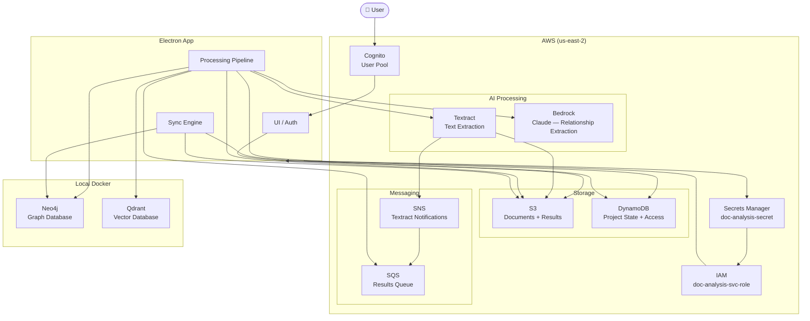
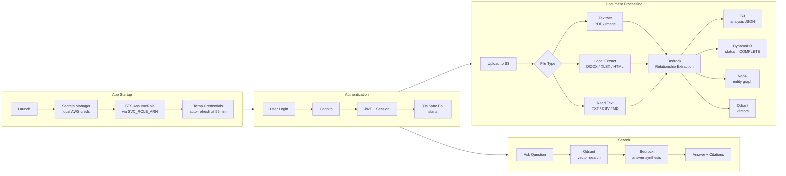

# Document Analysis Application

Local application for extracting relationships between entities (people, money, property, objects) across batches of documents. Uses an Electron front-end, AWS for document processing and cloud state, and local Docker containers for graph and vector storage.

---

## Architecture


```mermaid
flowchart TB
    User(["👤 User"])

    subgraph Electron ["Electron App"]
        UI["UI / Auth"]
        Sync["Sync Engine"]
        Pipeline["Processing Pipeline"]
    end

    subgraph AWS ["AWS (us-east-2)"]
        Cognito["Cognito\nUser Pool"]
        SecretsManager["Secrets Manager\ndoc-analysis-secret"]
        IAM["IAM\ndoc-analysis-svc-role"]

        subgraph Storage ["Storage"]
            S3["S3\nDocuments + Results"]
            DynamoDB["DynamoDB\nProject State + Access"]
        end

        subgraph Processing ["AI Processing"]
            Textract["Textract\nText Extraction"]
            Bedrock["Bedrock\nClaude — Relationship Extraction"]
        end

        subgraph Messaging ["Messaging"]
            SNS["SNS\nTextract Notifications"]
            SQS["SQS\nResults Queue"]
        end
    end

    subgraph Docker ["Local Docker"]
        Neo4j["Neo4j\nGraph Database"]
        Qdrant["Qdrant\nVector Database"]
    end

    Electron --> SecretsManager
    SecretsManager --> IAM
    IAM --> Electron
    User --> Cognito
    Cognito --> UI

    UI --> S3
    Pipeline --> Textract
    Textract --> S3
    Textract --> SNS
    SNS --> SQS
    Pipeline --> SQS
    Pipeline --> Bedrock
    Pipeline --> S3
    Pipeline --> DynamoDB
    Pipeline --> Neo4j
    Pipeline --> Qdrant

    Sync --> DynamoDB
    Sync --> S3
    Sync --> Neo4j
```

---

## High-Level Workflow


```mermaid
flowchart LR
    subgraph Boot ["App Startup"]
        direction LR
        B1["Launch"] --> B2["Secrets Manager\nlocal AWS creds"]
        B2 --> B3["STS AssumeRole\nvia SVC_ROLE_ARN"]
        B3 --> B4["Temp Credentials\nauto-refresh at 55 min"]
    end

    subgraph Login ["Authentication"]
        direction LR
        L1["User Login"] --> L2["Cognito"]
        L2 --> L3["JWT + Session"]
        L3 --> L4["30s Sync Poll\nstarts"]
    end

    subgraph Ingest ["Document Processing"]
        direction LR
        I1["Upload to S3"] --> I2{"File Type"}
        I2 --> I3["Textract\nPDF / Image"]
        I2 --> I4["Local Extract\nDOCX / XLSX / HTML"]
        I2 --> I5["Read Text\nTXT / CSV / MD"]
        I3 --> I6["Bedrock\nRelationship Extraction"]
        I4 --> I6
        I5 --> I6
        I6 --> I7["S3\nanalysis JSON"]
        I6 --> I8["DynamoDB\nstatus = COMPLETE"]
        I6 --> I9["Neo4j\nentity graph"]
        I6 --> I10["Qdrant\nvectors"]
    end

    subgraph Query ["Search"]
        direction LR
        Q1["Ask Question"] --> Q2["Qdrant\nvector search"]
        Q2 --> Q3["Bedrock\nanswer synthesis"]
        Q3 --> Q4["Answer + Citations"]
    end

    Boot --> Login
    Login --> Ingest
    Login --> Query
```

### How it works

1. **Startup** — On launch the app reads `doc-analysis-secret` from Secrets Manager using the local AWS CLI credentials. The secret contains the service role ARN (`SVC_ROLE_ARN`) along with all other app configuration. The app then assumes `doc-analysis-svc-role` via STS and uses the resulting temporary credentials for all subsequent AWS calls. Credentials auto-refresh before their 1-hour expiry.
2. **Auth** — The user logs in via Cognito. A 30-second background poll starts, syncing project and document state across devices.
3. **Upload** — Documents are uploaded to S3. Textract-compatible files (PDF, images) start an async Textract job with an SNS notification channel. Office files (DOCX, XLSX, HTML) are extracted locally via mammoth/ExcelJS. Plain-text files are read directly from S3.
4. **Processing** — Extracted text is passed to Bedrock (Claude) for entity and relationship extraction. Results are written to S3 (analysis JSON), DynamoDB (status), Neo4j (graph), and Qdrant (vector embeddings).
5. **Search** — Questions are answered by vector-searching Qdrant for relevant chunks and synthesising an answer via Bedrock, with source citations.
6. **Sync** — Every 30 seconds the app polls DynamoDB for new, deleted, or status-changed documents and reconciles local Neo4j and Qdrant accordingly, enabling multi-device and future multi-user project sharing.

---

## Prerequisites

- [Docker Desktop](https://www.docker.com/products/docker-desktop/)
- [AWS CLI](https://docs.aws.amazon.com/cli/latest/userguide/install-cliv2.html) configured with a valid IAM user (`aws configure`)

Your local IAM user needs two permissions:

| Permission | Purpose |
|---|---|
| `secretsmanager:GetSecretValue` on `doc-analysis-secret` | Read app config and role ARN at startup and when running `deploy.sh` |
| `sts:AssumeRole` on `doc-analysis-svc-role` | Assume the service role for all AWS resource operations |

---

## Infrastructure (Terraform)

AWS resources for this project are managed via Terraform in the [Terraform/](Terraform/) folder. Deployment is triggered manually via a GitHub Actions workflow.

### GitHub Actions workflow

1. Go to your repository on GitHub
2. Navigate to **Actions** → **AWS Setup**
3. Click **Run workflow** and select the branch

The workflow uses OIDC to authenticate with AWS — no AWS credentials need to be stored in GitHub. The required repository secrets and variables are:

| Type | Name | Description |
|---|---|---|
| Secret | `AWS_ACCOUNT_ID` | Your 12-digit AWS account ID |
| Secret | `AWS_DEPLOY_SVC_ACCT_ARN` | ARN of the GitHub Actions IAM role |
| Secret | `AWS_USER_ARN` | ARN of the IAM user allowed to assume the service role |
| Variable | `AWS_RESOURCE_REGION` | AWS region (e.g. `us-east-2`) |
| Variable | `PROJECT` | Human-readable project name |
| Variable | `TF_PROJECT_NAME` | Slug used for resource naming (e.g. `doc-analysis-app`) |
| Variable | `OWNER` | Owner name tagged on resources |
| Variable | `SECRETS_MANAGER_PATH` | Secrets Manager secret name (e.g. `doc-analysis-secret`) |

### Running Terraform locally

If you do not have access to the repository secrets, install [Terraform](https://developer.hashicorp.com/terraform/install) locally and pass all variables explicitly:

```bash
cd Terraform
terraform init
terraform apply \
  -var="account_id=YOUR_ACCOUNT_ID" \
  -var="region=us-east-2" \
  -var="project=Document Analysis Application" \
  -var="tf_project_name=doc-analysis-app" \
  -var="owner=YOUR_NAME" \
  -var="user_arn=arn:aws:iam::YOUR_ACCOUNT_ID:user/YOUR_USERNAME" \
  -var="github_org=YOUR_GITHUB_ORG" \
  -var="github_repo=YOUR_REPO_NAME" \
  -var="secrets_manager_path=doc-analysis-secret"
```

Terraform will populate `SVC_ROLE_ARN` and all other AWS resource identifiers directly into the secret on apply — no manual note-taking required.

---

## Local Services (Docker Compose)

Neo4j and Qdrant run locally via Docker Compose. The `deploy.sh` script pulls all credentials from Secrets Manager using your local AWS credentials and starts the containers.

### First-time setup

1. **Create the secret in AWS Secrets Manager** with the Neo4j and Qdrant credentials. Terraform will add all remaining keys (including `SVC_ROLE_ARN`) on first apply.

   ```bash
   aws secretsmanager create-secret \
     --name "doc-analysis-secret" \
     --secret-string '{"SVC_USER":"your-username","SVC_PWD":"your-password","QDRANT_KEY":"your-qdrant-api-key"}'
   ```

   If the secret already exists, update it:

   ```bash
   aws secretsmanager put-secret-value \
     --secret-id "doc-analysis-secret" \
     --secret-string '{"SVC_USER":"your-username","SVC_PWD":"your-password","QDRANT_KEY":"your-qdrant-api-key"}'
   ```

2. **Run Terraform** (via GitHub Actions or locally) to provision all AWS resources. Terraform will merge `SVC_ROLE_ARN` and all other resource identifiers into the secret automatically.

3. **Ensure your local IAM user** has `secretsmanager:GetSecretValue` on `doc-analysis-secret` and `sts:AssumeRole` on `doc-analysis-svc-role`.

### Starting the services

```bash
chmod +x deploy.sh   # first time only
./deploy.sh
```

The script will:
1. Read `SVC_PWD` and `QDRANT_KEY` from the `doc-analysis-secret` secret using your local AWS credentials
2. Write a temporary `.env` file
3. Start all containers via `docker compose up -d`
4. Delete the `.env` file immediately after

### Stopping the services

```bash
docker compose down
```

### Data storage

The script uses the primary path if it exists, otherwise falls back to the Docker volume location:

| | Path |
|---|---|
| Primary | `D:/Projects/.data/doc-analysis` |
| Fallback | `C:/ProgramData/docker/volumes/doc-analysis` |

> **Note:** Neo4j credentials are only applied on first initialisation. If you rotate the secret in AWS, run `docker compose down -v` to wipe the volumes before restarting so the new credentials take effect.

---

## App Configuration (.env)

The application reads two values from `Source/.env` at startup. Everything else comes from Secrets Manager.

```env
AWS_REGION=us-east-2
AWS_SECRET_NAME=doc-analysis-secret

# Local services — device-specific
NEO4J_URI=bolt://localhost:7687
QDRANT_URL=http://localhost:6333
```

---

## Local Services

| Service | Port | Purpose |
|---|---|---|
| Neo4j | `7474` (HTTP), `7687` (Bolt) | Graph database — entities and relationships |
| Qdrant | `6333` (HTTP), `6334` (gRPC) | Vector database — document embeddings |
